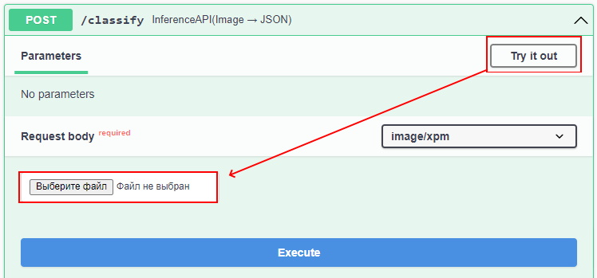
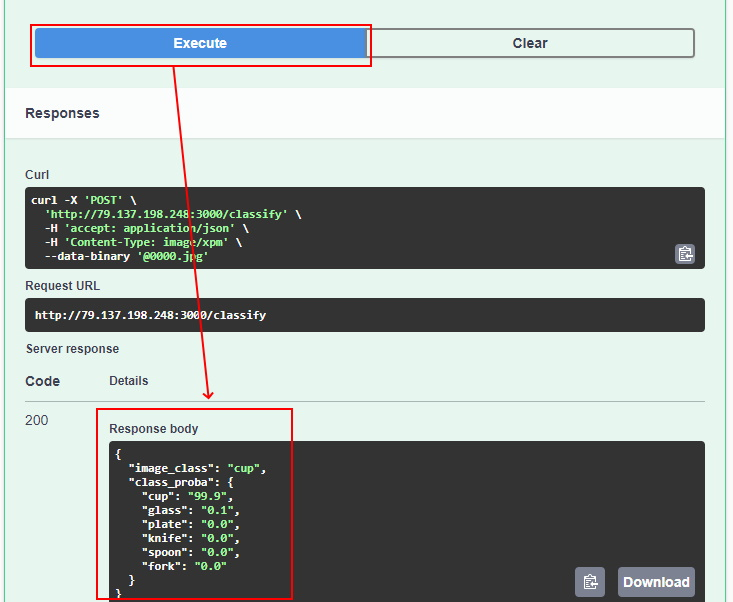

# Kitchenware image classification ([Kaggle Competition](https://www.kaggle.com/competitions/kitchenware-classification)) 

In this competition we need to classify images of different kitchenware items into 6 classes:

* cups
* glasses
* plates
* spoons
* forks
* knives

You can get this dataset from [kaggle](https://www.kaggle.com/competitions/kitchenware-classification)

## About files and folders in this repo

|  File name |      Description       |
|:--------:|:-----------------------------------:|
|    README.md   |Details about this project| 
|    notebook.ipynb   |Jupyter notebook file with EDA, training different models and choose the best model |
|    train.py   |Python script for training InceptionV3 model |
|    kitchenware_image_classiffication.h5   |Saved fitted InvceptionV3 model |
|    predict.ipynb   |Jupyter notebook file that loads the InvceptionV3 and make predictions|
|    Pipfile   |The concrete requirements for a Python Application|
|    Pipfile.lock   |The details of the environment|
|    bentoml.yaml   |Text document that contains all the commands to create docker container image|
 
## Dataset information:
This dataset consist of 5559 labeled images. The information about classes is in the train.py
In time series data we wish to predict some variable given only a trailing window of its previous values. 
In this model used [lag_1, lag_2, lag_3, lag_4, lag_5] features, which contains sales data for previous weeks

## How to reproduce the project
Clone this repo in your local machine with the command:
```
git clone https://github.com/Avisprof/ML_Zoomcamp_Midterm_Project.git
```
If you haven't installed `pipenv` yet, you need to do it with:
```
pip install pipenv
```
Then you can recreate the environment by running the below command in the project directory:
```
pipenv --python 3.9
pipenv install .
```

## Local deployment of the model
Run the docker image to start the BentoServer:
```
docker run -it -p 3000:3000 interests/kitchenware_image_classification:latest serve --production
```

Then open http://localhost:3000 in your browser and load image to prediction


Or you can make use http://79.137.198.248:3000/ with cloud deployment, than press "Post" button, after that press "Try it out" button:



Choose the image file and press the "Execute" button



